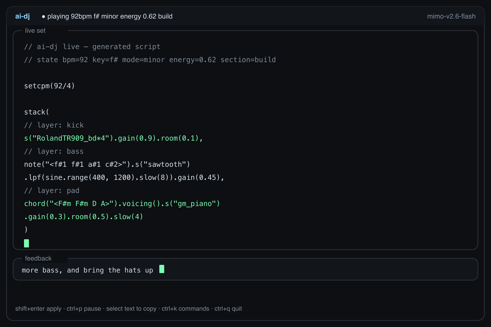
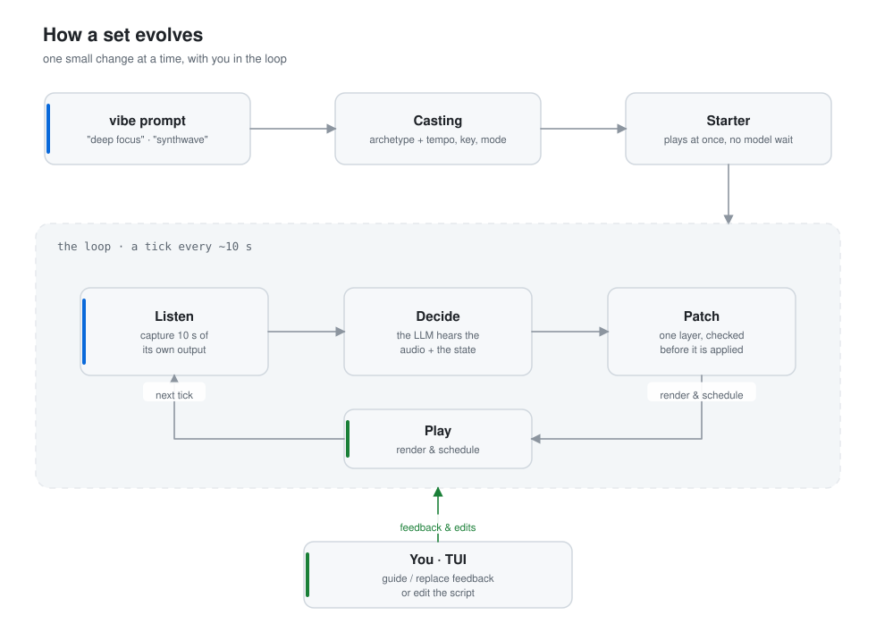
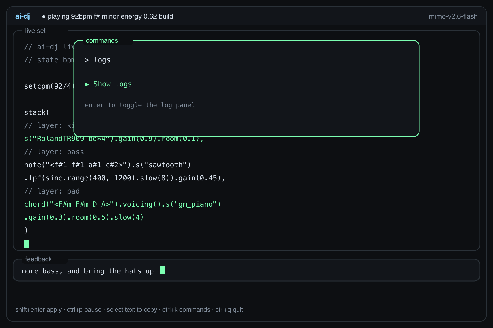
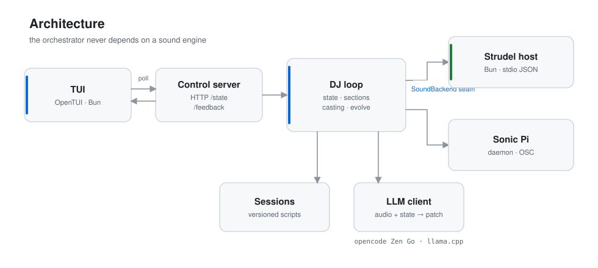

<div align="center">

# ai-dj

**A generative radio DJ.**

It writes a live set, listens to its own output, and evolves the music with an
LLM — on its own, or with you in the loop.

[](https://www.python.org/)
[](https://strudel.cc/)
[](#testing)
[](#license)



</div>

---

## Why

Background music for deep work is either a fixed playlist you get tired of, or a
stream you don't control. ai-dj generates it instead: a set that never repeats,
stays **non-vocal by construction**, and drifts the way a DJ would — building,
peaking, breaking down, and settling again.

It is not a chatbot that writes a song once. It is a loop that keeps listening
to what it just played and makes one small change at a time.

## How it works

<div align="center">

<picture>
  <source media="(prefers-color-scheme: dark)" srcset="docs/diagrams/flow-dark.svg">
  
</picture>

</div>

1. **Cast** — your vibe prompt picks an **archetype** (one of 16), fixing the
   tempo, key and mode. No model call: this is deterministic.
2. **Play** — a curated **starter** starts immediately, so there is music while
   the first model call runs.
3. **The loop**, every ~10 seconds:
   - **Listen** — capture 10 s of its own output (an offline render, not a mic).
   - **Decide** — the LLM hears that audio plus the current state and returns
     **one layer patch**, not a whole new script.
   - **Patch** — validate it, apply it, re-render the script.
   - **Play** — schedule the result and save a version.
4. **Sections** — an energy arc (`intro → build → peak → breakdown → peak →
   outro`) decides whether to add a layer or strip one back.
5. **You** — edit the script directly, or send *guide* / *replace* feedback from
   the TUI at any time.

The loop is built to be cheap: the system prompt is byte-identical on every call
(so it is fully prompt-cached), the model only ever returns one layer, and
reasoning is off by default.

## Quick start

### Requirements

| | |
|---|---|
| **Python** | 3.10 or newer |
| **Bun** | 1.1+ — runs the Strudel sound host and the TUI |
| **ffmpeg** | on `PATH` — transcodes captures to the mp3 the model hears |
| **A model** | an [opencode Zen Go](https://opencode.ai) key, *or* a local `llama.cpp` server |

Strudel is the default backend and needs no external daemon. Sonic Pi is
optional — see [`--backend sonic_pi`](#configuration).

### Install

```bash
git clone https://github.com/Cabeda/ai-dj.git
cd ai-dj

# 1. the Python package and the `ai-dj` command
python3 -m venv .venv && source .venv/bin/activate
pip install -e .

# 2. the Strudel sound host (installs its deps and bundles the host)
bash strudel/build.sh

# 3. the TUI
(cd tui && bun install)

# 4. your API key (loaded from ~/env by default)
echo 'export OPENCODE_API_KEY="sk-..."' > ~/env
```

### Run

```bash
ai-dj tui --prompt "deep focus"
```

Prefer no install? The repo ships a launcher that runs straight from a checkout:

```bash
./ai-dj tui --prompt "synthwave"
```

Hear a starter without any model or audio, to check your setup:

```bash
./ai-dj dry --seed 1
```

## The TUI

| Key | Action |
|---|---|
| `shift+enter` | apply the script you edited |
| `ctrl+a` | select the whole script — then type or paste to replace it |
| `ctrl+p` | pause / continue — silences the set and freezes the loop |
| `enter` *(feedback box)* | send **guide** feedback — nudge the set |
| `shift+enter` *(feedback box)* | send **replace** feedback — swap the whole vibe |
| `ctrl+y` | copy the focused pane as clean text |
| `ctrl+k` | command palette — paste/select the script, copy, reset, pause/continue, **show/hide logs** |
| `tab` | switch between the script and the feedback box |
| `ctrl+q` | quit |

**Pause** stops the audio *and* the loop — no captures, no model calls — so a
paused session costs nothing and continues exactly where it left off.

Drag to select with the mouse and your terminal copies natively — the TUI does
not capture the mouse. To **swap in a whole new script**, use the palette's
*Paste script from clipboard* (one step), or `ctrl+a` then paste. The **log is
hidden by default**; toggle it from the command palette:

<div align="center">



</div>

## Architecture

<div align="center">

<picture>
  <source media="(prefers-color-scheme: dark)" srcset="docs/diagrams/architecture-dark.svg">
  
</picture>

</div>

The orchestrator (state machine, LLM client, control server, UI) never depends on
a specific engine. All sound goes through a **`SoundBackend`** seam —
`boot` / `play` / `stop` / `set_volume` / `capture` / `shutdown`:

- **Strudel** *(default)* — headless [Strudel](https://strudel.cc) on Web Audio,
  running in Bun via `node-web-audio-api`, driven over line-delimited JSON on
  stdio. Capture is an `OfflineAudioContext` render, so it needs no audio device
  and is exact.
- **Sonic Pi** *(optional)* — the original backend; a native daemon driven over
  OSC.

Why Strudel, and the packaging constraints it brings, are recorded in
[`docs/adr/0001`](docs/adr/0001-sound-backend-seam-and-strudel.md).

## Instruments and archetypes

The model may only choose from a closed **instrument palette** — 64 instruments,
each with a per-backend realisation:

- **General MIDI soundfonts** (`gm_violin`, `gm_cello`, `gm_piano`, …) for the
  classical palette,
- **real samples** via VCSL (`harp`, `timpani`, `marimba`, …),
- **drum machines** (`RolandTR909_*`, `RolandTR808_*`, …).

The palette is generated into the model's prompt at build time
(`palette.as_markdown()`), so the reference can never drift from what actually
plays.

**16 archetypes** cover focus and classical material — `deep_focus`, `drone`,
`lofi_study`, `piano_study`, `vibes_room`, `marimba_room`, `string_quartet`,
`chamber`, `orchestral`, `solo_piano`, `harp_strings`, `ambient`, `techno`,
`house`, `downtempo`, `synthwave`. A test enforces that **no archetype uses a
vocal patch**.

## Configuration

### Models

```bash
# opencode Zen Go (default) — needs OPENCODE_API_KEY
ai-dj tui --model mimo-v2.6-flash

# a local llama.cpp server (no key; audio support depends on the model)
ai-dj models                       # list what is loaded
ai-dj tui --local --model <name>
```

### Flags

| Flag | Meaning |
|---|---|
| `--backend {strudel,sonic_pi}` | sound engine (default `strudel`) |
| `--prompt "..."` | initial vibe guide |
| `--seed N` | deterministic archetype choice |
| `--record [DIR]` | save every capture as a WAV (default `<session>/audio`) |
| `--reasoning {none,low,medium,high}` | reasoning effort (default `none`) |
| `--no-reference` | drop the language reference from the prompt |
| `--env PATH` | file holding `OPENCODE_API_KEY` (default `~/env`) |

### Commands

```
ai-dj tui [--prompt V]     live TUI: editable script + queued feedback
ai-dj new [--seed N]       fresh session, live-coded, in the terminal
ai-dj pick <session-id>    resume a saved session
ai-dj list                 list saved sessions
ai-dj models               list models on the local llama.cpp server
ai-dj probe [--audio F]    one-shot listen + decide
ai-dj dry [--seed N]       render a random starter, no audio
```

## Sessions

Every evolve is saved as a numbered version under `sessions/<id>/`, with
`last.mjs` symlinked to the newest. History is bounded (`KEEP_VERSIONS = 200`)
so an all-day run cannot fill the disk, and pruning is per-extension so a
symlink can never be orphaned. Resume with `ai-dj pick <id>`.

## Contributing

```bash
python3 -m unittest discover -s tests     # 82 tests (~3 min; some render audio)
(cd tui && bunx tsc --noEmit -p tsconfig.json)   # typecheck the TUI
bash strudel/build.sh                     # rebuild the host after editing strudel/*.ts
python3 scripts/make_diagrams.py          # regenerate the README diagrams
```

A few conventions worth knowing:

- **`CONTEXT.md` is the glossary** and the source of truth for vocabulary
  (Backend, Script, Layer, Archetype, Casting, …). Use its words.
- **Architecture decisions live in `docs/adr/`.** Add one when you change a
  load-bearing decision.
- **`strudel/*.bundle.mjs` is generated** and gitignored — edit the `.ts` and
  run `strudel/build.sh`, never the bundle.
- **The palette is closed.** Adding an instrument means adding it to
  `ai_dj/palette.py`; it reaches the model automatically.
- **Non-vocal is a rule, not a default.** No archetype may introduce a voice
  patch.

### Testing

The suite covers the backend seam, the palette (including a render-audit that
every Strudel instrument produces audio), session versioning, the archetypes,
the quality metrics, and reference-replication against public-domain scores.

## License

ai-dj is [MIT licensed](LICENSE). It depends on **Strudel**, which is
**AGPL-3.0-or-later** — a distribution that bundles the Strudel host must comply
with the AGPL. See
[`docs/adr/0001`](docs/adr/0001-sound-backend-seam-and-strudel.md).
